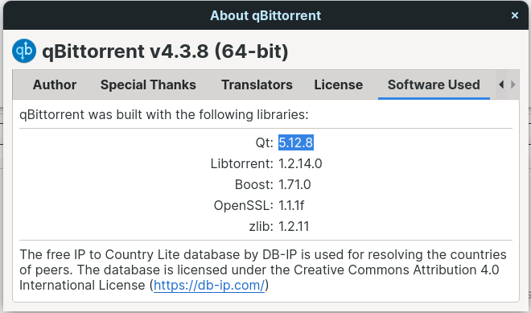

# How to
Please find instruction to build your own version of the themes.

## Pre-requisites
 - [Python3](https://www.python.org/downloads/)

## Get rcc

Get the Qt version used by your version of qBittorrent.
 1. Launch qBittorrent
 1. Go to `help` -> `About` -> `Software Used`
 1. Save the Qt version number
 
 

Some versions of rcc are available in [tools](tools/). If there is the correct one, just rename it and make it executable.
```sh
mv tools/rcc-qtx_x_x tools/rcc
chmod +x tools/rcc
```
If not, you have to install Qt. To keep your main system clear, you can do it in a [VM](https://en.wikipedia.org/wiki/Virtual_machine).
 1. Go to [Qt open-source download page](https://download.qt.io/official_releases/qt/) and find the correct version
 1. Download *qt-opensource-linux-x64-x.x.x.run*
 1. Install it
 ```sh
 chmod +x qt-opensource-linux-x64-*.run
 qt-opensource-linux-x64-*.run
 ```
 1. Choose *Qtx.x.x/Desktop gcc 64-bit* componant
 1. Locate rcc file and copy it. Do not choose a *Src* one.
 ```sh
 sudo find / -name rcc 2> /dev/null
 cp /home/<user>/Qt<x.x.x>/<x.x.x>/gcc_64/bin/rcc tools/rcc
 ```
 
## Build
Now, you have everything to build your version. You just have to run *.sh* files.
```sh
chmod +x ./build-*.sh
for f in build-*.sh; do
  bash "$f"
done
```

You can now use your qbtheme files by adding them in qBittorrent's preferences. Completely restart the application. Warning, by default, it stays in the taskbar.
